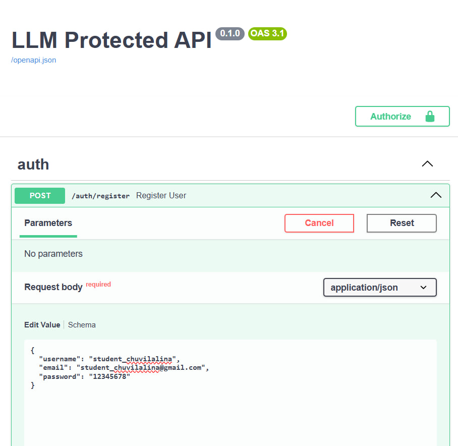
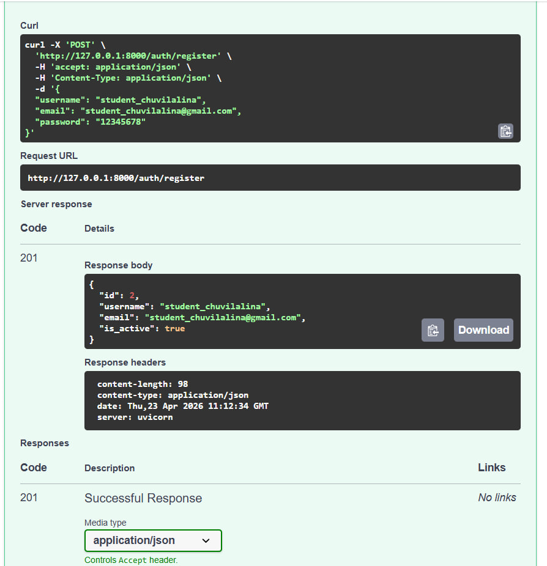
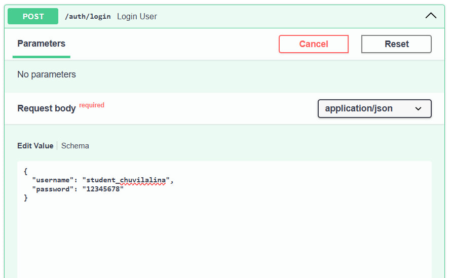
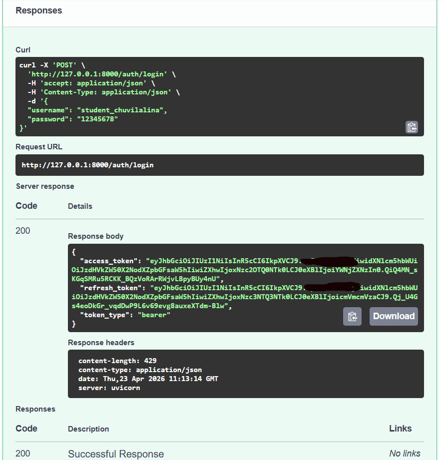
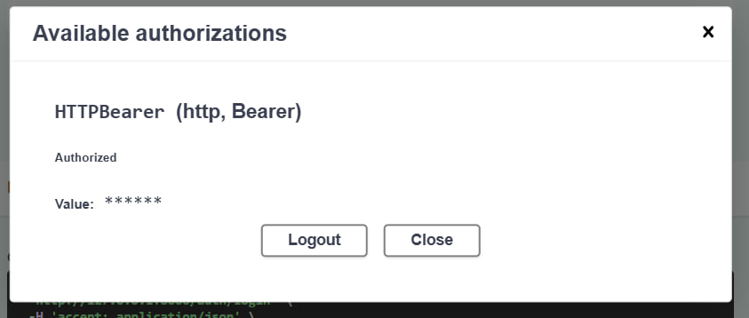
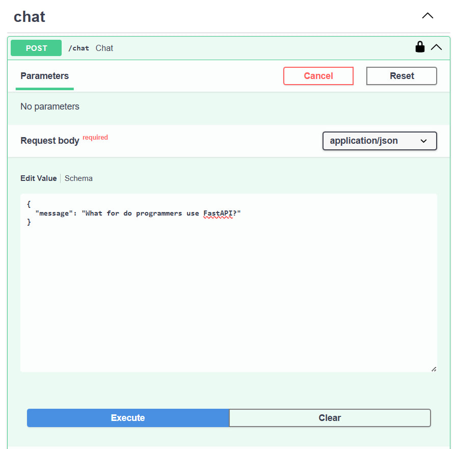
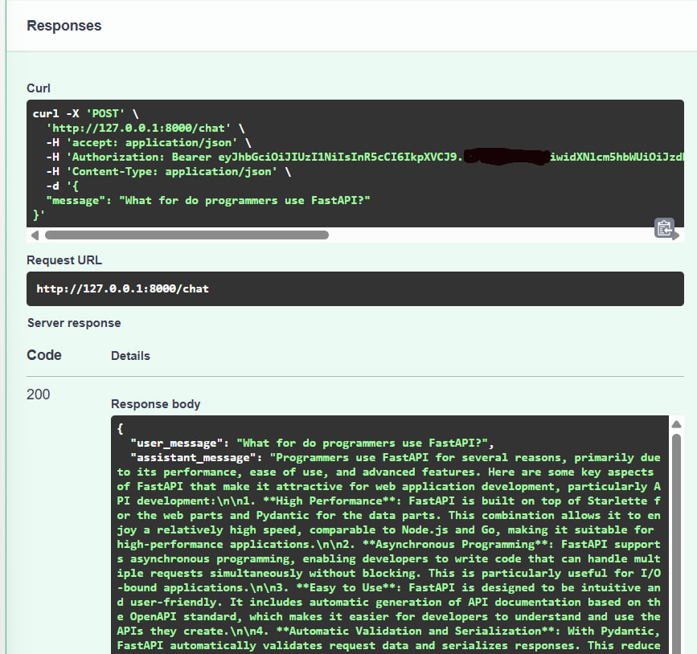
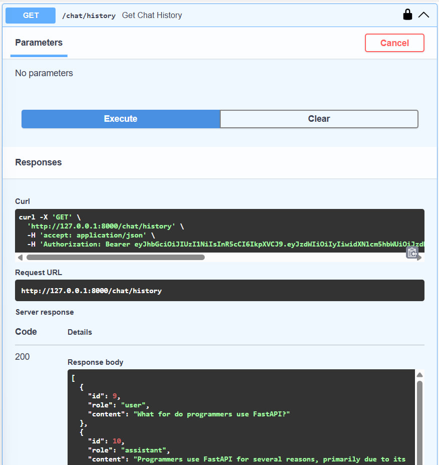
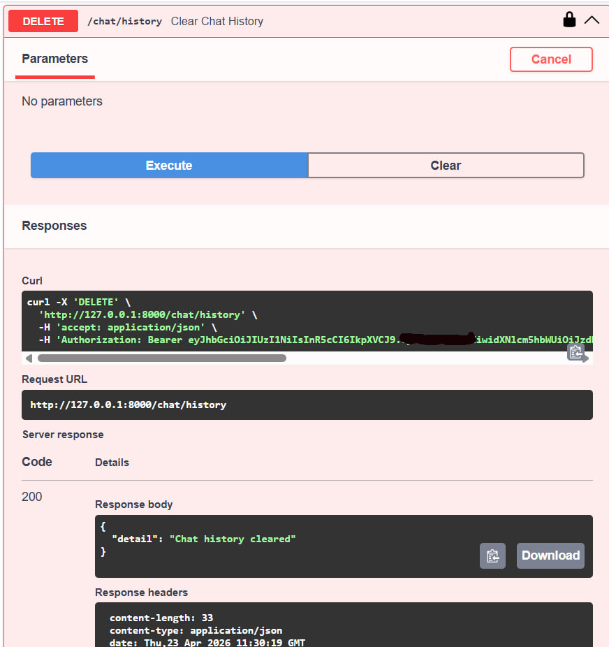

# LLM Protected API

Проект представляет собой защищённый backend API на FastAPI для работы с большой языковой моделью.

## Реализованные возможности

- регистрация и аутентификация пользователей  
- JWT access и refresh токены  
- защищённые маршруты  
- интеграция с OpenRouter  
- хранение истории переписки в SQLite  
- получение и очистка истории чата  

---

## Стек технологий

- Python 3.11  
- FastAPI  
- Uvicorn  
- SQLAlchemy  
- SQLite  
- Pydantic  
- JWT (`python-jose`)  
- passlib  
- httpx  
- OpenRouter API  
- Ruff  
- uv  

---

## Структура проекта

```text
app/
├── api/
│   ├── auth.py
│   ├── chat.py
│   └── users.py
├── models/
│   ├── chat.py
│   └── user.py
├── schemas/
│   ├── chat.py
│   └── user.py
├── services/
│   ├── chat_service.py
│   └── openrouter_service.py
├── config.py
├── database.py
├── dependencies.py
├── main.py
└── security.py
````

---

## Установка и запуск через uv

### 1. Клонирование проекта

```bash
git clone <URL_ВАШЕГО_РЕПОЗИТОРИЯ>
cd llm-p
```

---

### 2. Создание виртуального окружения

```bash
uv venv
source .venv/Scripts/activate
```

---

### 3. Установка зависимостей

Если зависимости уже описаны в проекте:

```bash
uv sync
```

Если нужно установить вручную:

```bash
uv add fastapi uvicorn sqlalchemy aiosqlite pydantic-settings python-jose[cryptography] passlib[bcrypt] httpx ruff email-validator "bcrypt<4"
```

---

### 4. Настройка файла `.env`

Создайте файл `.env` в корне проекта:

```env
APP_NAME=LLM Protected API
DATABASE_URL=sqlite+aiosqlite:///./app.db

JWT_SECRET_KEY=your_secret_key
JWT_ALGORITHM=HS256
ACCESS_TOKEN_EXPIRE_MINUTES=30
REFRESH_TOKEN_EXPIRE_DAYS=7

OPENROUTER_API_KEY=your_openrouter_api_key
OPENROUTER_BASE_URL=https://openrouter.ai/api/v1
OPENROUTER_MODEL=openai/gpt-4o-mini
```

---

### 5. Запуск проекта

```bash
uv run uvicorn app.main:app --reload --host 0.0.0.0 --port 8000
```

---

### 6. Swagger UI

После запуска документация доступна по адресу:

```
http://127.0.0.1:8000/docs
```

---

## Реализованные эндпоинты

### Аутентификация

* `POST /auth/register` — регистрация пользователя
* `POST /auth/login` — логин и получение JWT токенов
* `POST /auth/refresh` — обновление токенов

### Пользователь

* `GET /users/me` — информация о текущем пользователе

### Чат

* `POST /chat` — отправка сообщения в LLM
* `GET /chat/history` — получение истории
* `DELETE /chat/history` — очистка истории

---

## Демонстрация работы

### 1. Регистрация пользователя

При регистрации использован email требуемого формата:
`student_chuvilalina@gmail.com`




---

### 2. Логин и получение JWT токенов




---

### 3. Авторизация через Swagger



---

### 4. Вызов POST /chat




---

### 5. Получение истории чата



---

### 6. Удаление истории чата



---

## Пример сценария работы

1. Регистрация пользователя
2. Логин и получение токенов
3. Авторизация через Swagger
4. Отправка сообщения в чат
5. Получение истории
6. Очистка истории

---

## Проверка качества кода

```bash
uv run ruff check .
```

Результат:

```
All checks passed!
```

---

## Архитектурные особенности

* роутеры: `app/api`
* схемы: `app/schemas`
* модели: `app/models`
* бизнес-логика: `app/services`
* зависимости: `app/dependencies`

---

## Итог

Проект реализует защищённый API для работы с большой языковой моделью.

* использована современная архитектура
* реализована авторизация через JWT
* подключена реальная LLM через OpenRouter
* реализовано хранение истории
